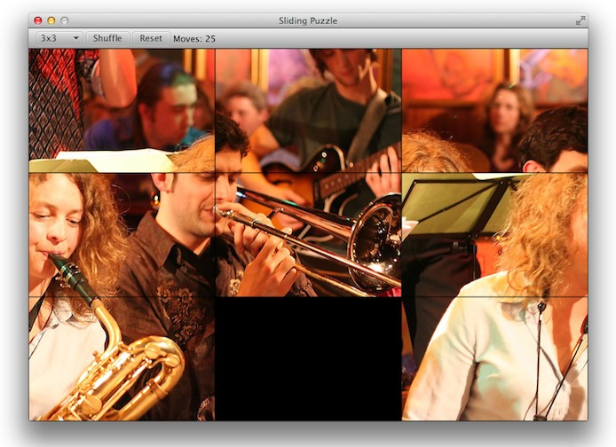
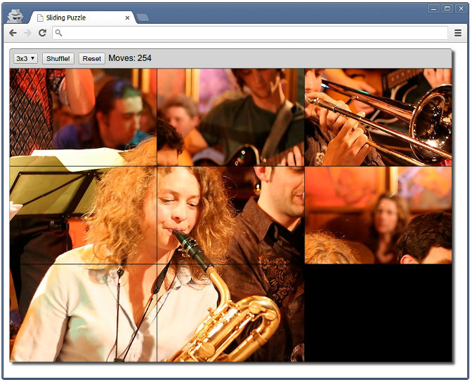

# Sliding Puzzle

[Sliding Puzzle](http://en.wikipedia.org/wiki/Sliding_puzzle) implemented in [**Scala**](http://www.scala-lang.org/).

See the online demo here: [http://www.sebnozzi.com/demos/sliding-puzzle/](http://www.sebnozzi.com/demos/sliding-puzzle/)

Dowload [executable JAR](http://www.sebnozzi.com/demos/sliding-puzzle/slidingPuzzle.jar) and run locally (requires Oracle's JRE).

## Multi-platform

Thanks to [Scala.js](http://www.scala-js.org/), it compiles both to:

1. Desktop JVM application
2. Browser JavaScript RIA

As much as possible, I've tried to have UI and platform-agnostic code. This lead to a better design which made the different implementations not only possible but straightforward.

### Desktop Version

The native JVM version uses [JavaFX](http://en.wikipedia.org/wiki/JavaFX) for its UI, and can be seen here:



### Browser Version

Here's a screenshot of the [Scala.js](http://www.scala-js.org/) based version, running on the browser:



## Building

### JavaFX Version

You'll need Oracle's JDK 7 or later (as of 2013, OpenJDK will not work as it does not include JavaFX - yet?).

#### Running

Run using SBT with:

```
sbt javafx/run
```

#### Packaging

Package as a stand-alone JAR with:

```
sbt javafx/assembly
```

This makes use of the [SBT-assebly](https://github.com/sbt/sbt-assembly) plugin.

### Scala.js Version

#### Unoptimized / Development

Development, or "unoptimized", mode compiles code very quick. The caveat is that the generated code is very big and takes longer for the browser to load. Nevertheless the loading time is small enough (around 5 seconds) to do development in this mode.

Package unoptimized code with SBT with:

```
sbt scalajs/packageJS
```

This will generate unoptimized JavaScript files.

To load the unoptimized version of the puzzle, open this file in your browser:

```
scalajs/index-dev.html
```

#### Optimized / Production

Optimized code takes considerably longer to compile, but the generated code is much smaller (around 200 Kb) and loads very quickly in the browser.

Generate optimized code with SBT with:

```
sbt scalajs/optimizeJS
```

This will generate one optimized JavaScript file using [Google's closure compiler](https://developers.google.com/closure/compiler/).

To load the optimized version of the puzzle, open this file in your browser:

```
scalajs/index.html
```

## Credits

### Scala.js

Scala.js-related acknowledgements:

* Thanks to Sébastien Doeraene and the EPFL for Scala.js!
* Thanks to all Scala.js [contributors](http://www.scala-js.org/contribute/)
* Thanks to Li Haoyi for the Scala.js [jQuery wrappers](https://github.com/scala-js/scala-js-jquery)
* The multi-platform SBT setup is "inspired" by [this project](https://github.com/sjrd/funlabyrinthe-scala), also by Sébastien Doeraene

### About the picture

The musicians you see on the picture are part of a Jazz "[Big Band](http://en.wikipedia.org/wiki/Big_band)".


> Tini Thomsen and Matthias Konrad 
> with the Thomsen Group @ Birdland, Hamburg

I wanted to use this picture for this puzzle because it portraits two of my favourite jazz-instruments: 

* **baritone sax** (left)
* **trombone** (right)

Original [picture](http://www.flickr.com/photos/mawel/2322324186/) taken by [Marc Wellekötter](http://www.flickr.com/photos/mawel/)
