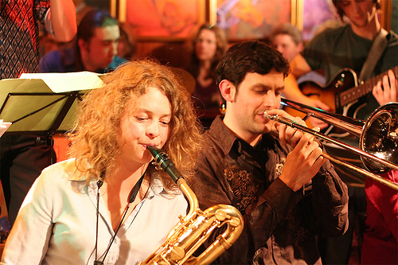

# Sliding Puzzle

[Sliding Puzzle](http://en.wikipedia.org/wiki/Sliding_puzzle) implemented in [**Scala**](http://www.scala-lang.org/).

## Multi-platform

Thanks to [Scala.js](http://www.scala-js.org/), it compiles both to:

1. Desktop JVM application
2. Browser JavaScript RIA

As much as possible, I've tried to have UI and platform-agnostic code. This lead to a better design which made the different implementations not only possible but straightforward.

### Desktop Version

The native JVM version uses [JavaFX](http://en.wikipedia.org/wiki/JavaFX) for its UI, and can be seen here:


### Browser Version

Here's a screenshot of the [Scala.js](http://www.scala-js.org/) based version, running on the browser:


## Building

### JavaFX Version

You'll need Oracle's JDK 7 or later (as of 2013, OpenJDK will not work as it does not include JavaFX).

Once in sbt, run:

```
javafx/run
```

### Scala.js Version

You need to properly "install" Scala.js as instructed on its website (build and publish locally).

#### Unoptimized / Development

Development, or "unoptimized", mode compiles code very quick. The caveat is that the generated code is very big and takes longer for the browser to load.

```
scalajs/packageJS
```

This will generate unoptimized JavaScript files. To load the unoptimized version of the puzzle, open `index-dev.html` in the browser (located inside the `scalajs` directory).

#### Optimized / Production

Optimized code takes considerably longer to compile, but the generated code is much smaller and loads very quickly in the browser.

```
scalajs/optimizeJS
```

This will generate one optimized JavaScript file using [Google's closure compiler](https://developers.google.com/closure/compiler/).

To load the optimized version of the puzzle, open `index.html` in the browser (located inside the `scalajs` directory).

## Notes

### About the picture

The musicians you see on the picture are part of a Jazz "[Big Band](http://en.wikipedia.org/wiki/Big_band)".



> Tini Thomsen and Matthias Konrad 
> with the Thomsen Group @ Birdland, Hamburg

I wanted to use this picture for this puzzle because it portraits two of my favourite jazz-instruments: 

* **baritone sax** (left)
* **trombone** (right)

Original [picture](http://www.flickr.com/photos/mawel/2322324186/) taken by [Marc Wellekötter](http://www.flickr.com/photos/mawel/)
